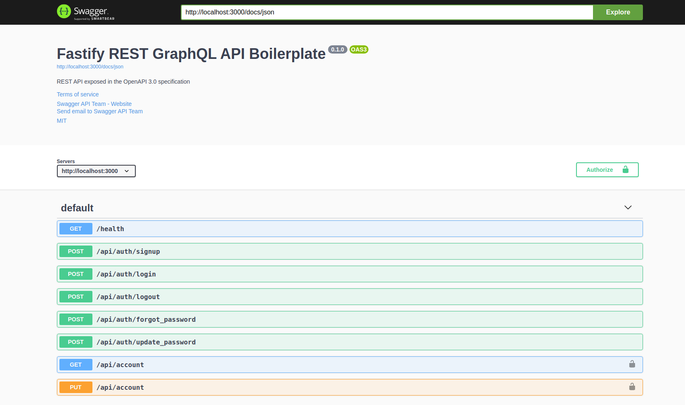
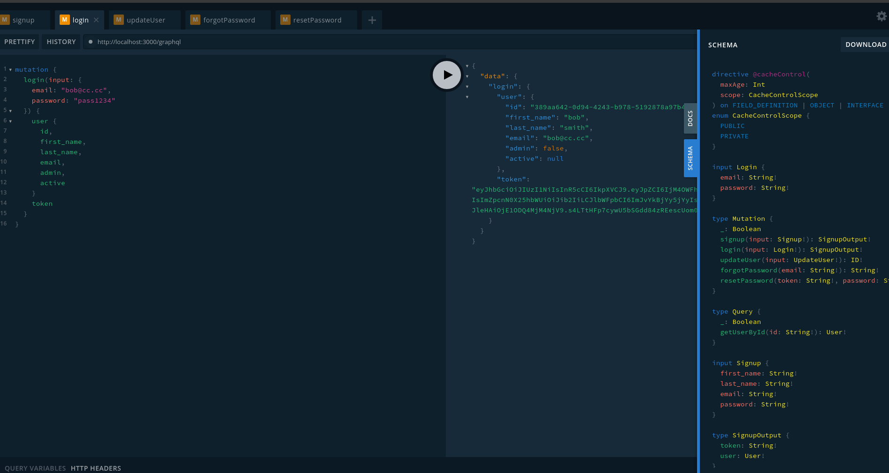

[](https://travis-ci.org/yhagio/fastify-rest-graphql-api.svg?branch=master)
[](https://codecov.io/gh/yhagio/fastify-rest-graphql-api)
[](https://opensource.org/licenses/mit-license.php)
[](https://github.com/ellerbrock/open-source-badges/)

# Fastify REST GraphQL API Boilerplate

Built with 💖

- [Node.js](https://nodejs.org/en/)
- [TypeScript](https://www.typescriptlang.org/)
- [Fastify](https://www.fastify.io/)
- [Apollo Server](https://github.com/apollographql/apollo-server)
- [Knex](https://knexjs.org/)
- [Postgres](https://www.postgresql.org/)
- [Mailgun-JS](https://github.com/mailgun/mailgun-js)
- [Mocha](https://mochajs.org/)

---

### Features 🎁

- [x] User Auth functionality (Signup, Login, Forgot Password, Reset Password)
- [x] JWT Authentication
- [x] REST API
- [x] Dependency injection
- [x] Configs via environmental variables
- [x] Email notification (Welcome email, Reset password email)
- [x] Knex with Postgres implementation
- [x] Unit tests
- [x] Travis CI
- [x] Badges (coverage, opesn source, MIT, up-to-date dependencies)
- [x] MIT LICENSE
- [x] GraphQL API
- [x] GraphQL playground
- [x] Swagger REST API documentation
- [ ] Diagram, detailed documentaion of each section
- [ ] Refactor
- [ ] Heroku deploy for demo?
- [ ] ? Auto migration (optional via env var)

---

swagger



graphql playground



---

### Run locally 🚙

Envronmental variables, see `./config`.
You can customize the `./config/default.json` and `./config/custom-environment-variables.json`.

You can put `.env` in root of repo as well
```sh
MAILGUN_API_KEY=key-b9jksfh8s9843uhfsdhds
MAILGUN_DOMAIN=xxxxx.mailgun.org

LOG_LEVEL=info

APP_DB_TYPE=postgres
APP_DB_HOST=localhost
APP_DB_PORT=5432
APP_DB_DB=my-db
APP_DB_USER=local-user
APP_DB_PASSWORD=password

JWT_SECRET=secret
JWT_EXPIRES_IN=3h

ENV=development

APP_PORT=3000
APP_HOST=http://localhost
```

Run
```sh
# Terminal 1
docker-compose up        # docker-compose up (Run postgres)
docker-compose down      # docker-compose down (Shutdown postgres)

# Terminal 2
yarn migrate           # Migrate DB
yarn rollback          # Rollback migration
yarn dev               # Run application
yarn test              # Run unit tests (lint & format code as well)
yarn build             # Build application
```

You can see graphql playground at `http:/localhost:3000/graphql` once application is up and running.

You can see swagger REST API docs at `http:/localhost:3000/docs` once application is up and running.

See more commands in `./package.json`
